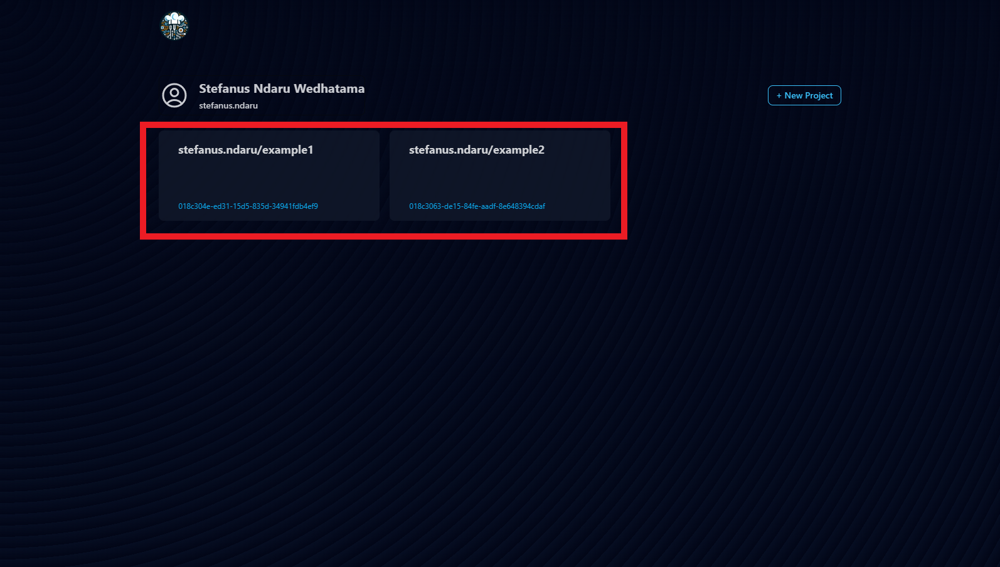
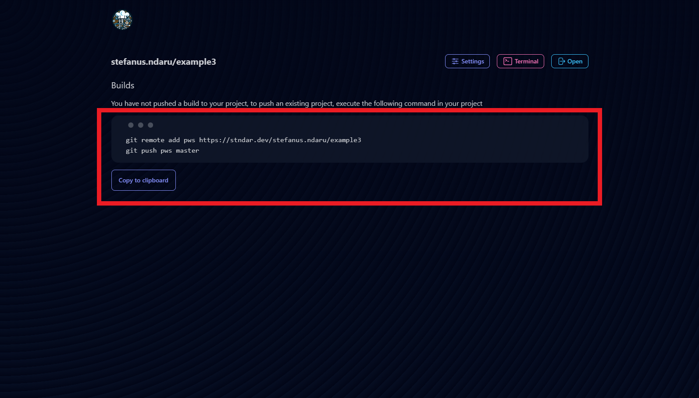

# Deploying Your Project
Learn how to deploy your first project in PWS.

## Pushing Changes
1. Go to the project page at `https://stndar.dev/{{ USERNAME }}/{{ PROJECT NAME }}`, or accessing the project you want to deploy from the dashboard.    
       
   
2. Copy the command to push. If you want to write it yourself, the format for the command is as follows: 
   ```
    git remote add pws https://stndar.dev/{{ USERNAME }}/{{ PROJECT NAME }}
    git push pws master
    ```
   
3. Open a terminal directed to your project's directory. In this example, my project is stored at
   a
   
4. Ensure your project has the correct configuration.
   1. For Django projects, make sure you have `gunicorn` installed in the `requirements.txt`.


5. In the terminal, paste the command to push your project to PWS.
   1. If your main branch uses `main`, replace `git push pws master` with `git push pws main:master`.